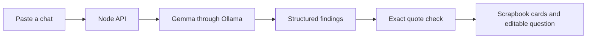

# The One Missing Question

**A small scrapbook for the friend who keeps the group chat moving.** Paste a planning conversation and get a short view of what is supported by the messages, what is unresolved, and one question to ask next.

 

> The sample conversation is fictional. Do not publish real group messages without everyone’s consent.

## Why this exists

Planning chats often contain a time suggestion, a different venue, and a few vague yeses. A normal summarizer can make those sound like a settled plan. This app keeps the uncertainty visible. Every item in **Seems settled** includes an exact quote from the pasted chat; the server drops any item whose quote cannot be found. A matching quote shows what was said, so the user still checks whether the group actually agreed.

The app currently has no account, database, or chat history. It sends the pasted text to the Ollama instance configured for the server and does not store it. For real conversations, run both the app and Ollama locally. A hosted deployment processes text on its server.

## Run locally

You need Node.js 22 or newer and [Ollama](https://ollama.com/download).

```powershell
ollama pull gemma4:e2b
npm start
```

Open `http://localhost:3000`, choose **Try a sample chat**, then **Find the missing question**. Ollama must be running. On Windows, launching the Ollama app normally starts its local server. To use another installed model or Ollama host:

```powershell
$env:OLLAMA_MODEL = 'gemma4:e2b'
$env:OLLAMA_BASE_URL = 'http://127.0.0.1:11434'
npm start
```

The first model download may take time. The interface and API run without npm dependencies.

## What happens to a chat



Gemma does the useful work: it identifies candidate agreements, conflicts, and a next question. Ollama requests a JSON schema, and the server validates the returned shape and each evidence quote. The deterministic quote check can reject unsupported citations; it cannot prove that every interpretation is correct. The user reviews the cards before sending anything.

## Checks

```powershell
npm test
```

The focused tests cover quote rejection, the Ollama request, and API input validation. They use a mock model response, so they do not measure Gemma’s actual answer quality. Before publishing a demo, try at least five varied fictional chats and keep notes on incorrect agreements and missed contradictions.

## Deploy on Render

[`render.yaml`](render.yaml) defines a public Node web service and a private Ollama service. Render serves the app and runs its Gemma inference. The private service pulls `gemma4:e2b` on startup and stores it on a persistent disk. The blueprint uses a **paid 2 CPU / 8 GB model service and a paid disk**; review current Render charges and available challenge credits before applying it. The web service is configured on the free plan. The model service is private to Render’s network, but the public app still sends submitted chat text to that hosted service.

Deployment steps:

1. Push this new repository to GitHub.
2. In Render, create a Blueprint from the repository and review both services and costs.
3. Wait for the private model service to download Gemma, then open the public web URL.
4. Run the fictional sample and verify the output. Record the URL and a short video for the challenge article.

The model is intentionally separate from the web process because its download and memory needs differ. A model startup may take several minutes; the app reports a retryable error if inference is not ready yet.

## Challenge fit

- **Gemma featured category:** Gemma 4 E2B is the open-weight reasoning engine that reads the chat and drafts the question.
- **Render featured category:** Render hosts the UI, API, and private Gemma runtime in the deployment blueprint.
- **Theme:** The intended user is one real friend who organizes plans. The project needs a real handoff and feedback before the submission story can truthfully claim that outcome.

The [Hacktoberfest Weekend Challenge](https://dev.to/challenges/hacktoberfest-weekend-2026-10-01) closes **October 5, 2026 at 06:59 UTC**. Use the required DEV tags `devchallenge`, `weekendchallenge`, and `hf26challenge`. The article should link to code and a demo, explain why open-weight AI matters here, and report the actual friend’s response.

## Boundaries

- Only paste messages needed to settle the plan.
- A supporting quote means the text appears in the source, not that all participants agreed with it. Review the interpretation.
- The question is a draft. Edit it before sending.
- The sample is fictional; replace it with a consented real test for the challenge story.

## Sources

- [Gemma with Ollama](https://ai.google.dev/gemma/docs/integrations/ollama)
- [Ollama structured outputs](https://docs.ollama.com/capabilities/structured-outputs)
- [Render Blueprint specification](https://render.com/docs/blueprint-spec)
- [Challenge brief](https://dev.to/challenges/hacktoberfest-weekend-2026-10-01)
