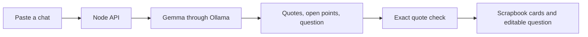

# The One Missing Question

**A small scrapbook for the friend who keeps the group chat moving.** Paste a planning conversation and get a short view of what is supported by the messages, what is unresolved, and one question to ask next.


> Try the built-in sample first. Share private group messages only with everyone’s consent.

## Why this exists

Planning chats often contain a time suggestion, a different venue, and a few vague yeses. A normal summarizer can make those sound like a settled plan. This app keeps the uncertainty visible. **What was said** shows exact excerpts from the chat, while Gemma suggests open points and one question. The server drops any excerpt it cannot find in the original text. The app never labels a suggestion as a group decision.

The app currently has no account, database, or chat history. It sends the pasted text to the Ollama instance configured for the server and does not store it. For real conversations, run both the app and Ollama locally. A hosted deployment processes text on its server.

## Run locally

You need Node.js 22 or newer and [Ollama](https://ollama.com/download).

```powershell
ollama pull gemma2:2b-instruct-q3_K_S
npm start
```

Open `http://localhost:3000`, choose **Try a sample chat**, then **Find the missing question**. Ollama must be running. On Windows, launching the Ollama app normally starts its local server. To use another installed model or Ollama host:

```powershell
$env:OLLAMA_MODEL = 'gemma2:2b-instruct-q3_K_S'
$env:OLLAMA_BASE_URL = 'http://127.0.0.1:11434'
npm start
```

The first model download may take time. The interface and API run without npm dependencies.

## What happens to a chat



Gemma does the useful work: it selects relevant excerpts, identifies conflicts, and drafts a next question. Ollama requests a JSON schema, and the server validates the returned shape and each excerpt. The deterministic quote check rejects invented wording. Gemma can still miss a conflict or ask the wrong question, so the user reviews and edits the result.

## Checks

```powershell
npm test
```

The focused tests cover quote rejection, the Ollama request, and API input validation. They use a mock model response, so they do not measure Gemma’s actual answer quality. Live checks with five sample chats found that the first design wrongly promoted suggestions to agreements. That result led to the source-excerpt design. The final Gemma 2 run produced valid responses for all five chats. Its questions can still be broad, so edit before using them.

## Deploy on Render

[`render.yaml`](render.yaml) defines a public Node web service and a private Ollama service. The private service pulls `gemma2:2b-instruct-q3_K_S` on startup and stores it on a persistent disk. The blueprint uses a **paid 1 CPU / 2 GB model service and a 3 GB disk** (about $25.75/month at current list prices, prorated while active). The model may be close to the memory limit on this tier. The web service is configured on the free plan. The model service is private to Render’s network, but the public app still sends submitted chat text to that hosted service.

Deployment steps:

1. Push this new repository to GitHub.
2. In Render, create a Blueprint from the repository and review both services and costs.
3. Wait for the private model service to download Gemma, then open the public web URL.
4. Run the built-in sample and verify the output.

The model is intentionally separate from the web process because its download and memory needs differ. A model startup may take several minutes; the app reports a retryable error if inference is not ready yet.

## Boundaries

- Only paste messages needed to settle the plan.
- A displayed quote means the text appears in the source, not that all participants agreed with it. Review the interpretation.
- The question is a draft. Edit it before sending.
- Get the group's consent before using their chat.

## Sources

- [Gemma with Ollama](https://ai.google.dev/gemma/docs/integrations/ollama)
- [Ollama structured outputs](https://docs.ollama.com/capabilities/structured-outputs)
- [Render Blueprint specification](https://render.com/docs/blueprint-spec)
